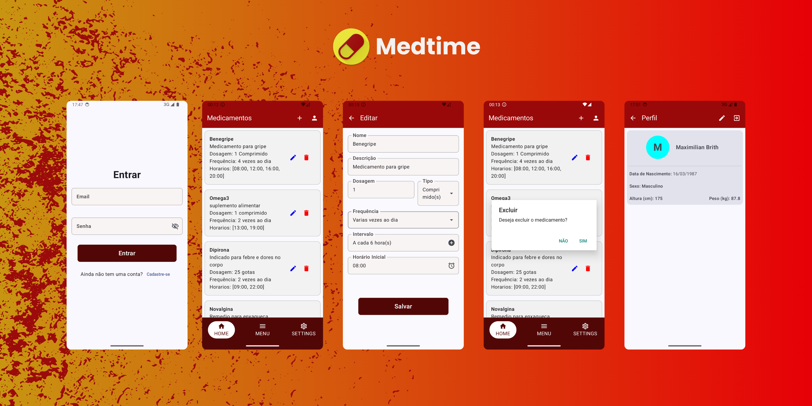
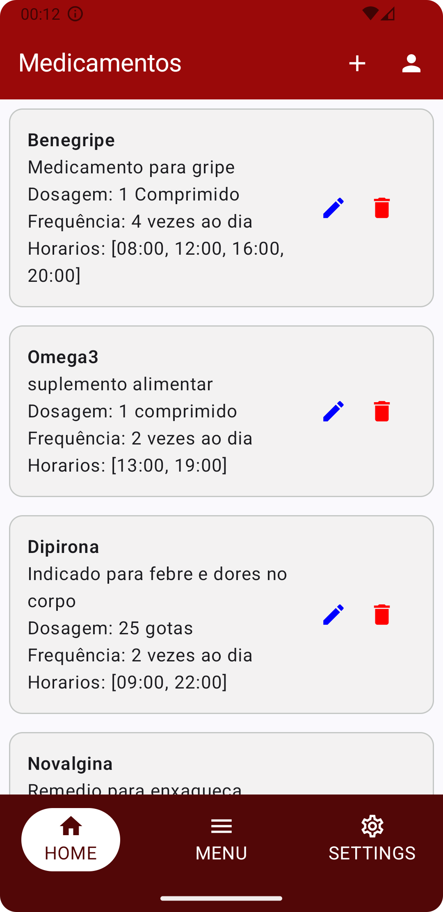
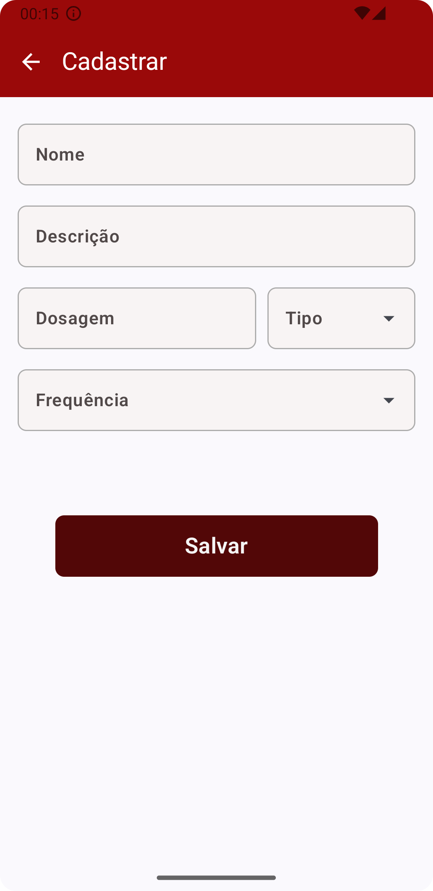
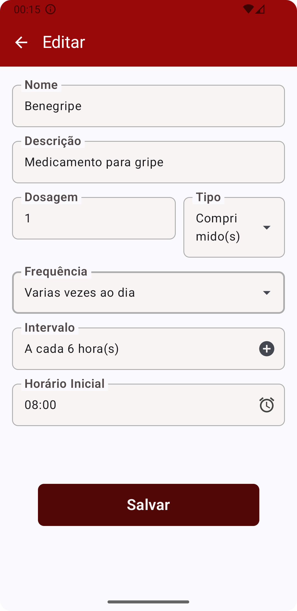
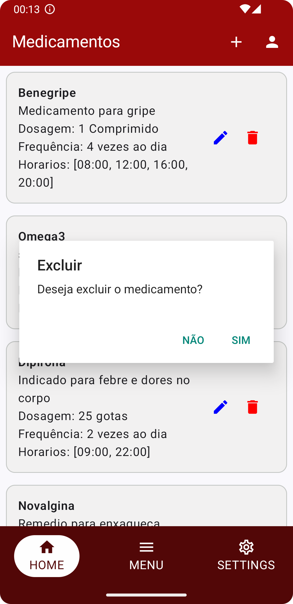

<h1 align="center">


[](https://kotlinlang.org/docs/getting-started.html)
[](https://developer.android.com/compose)
[](https://firebase.google.com/docs/firestore?hl=pt-br)
[](https://github.com/faamaral/medtime/releases)

</h1>

___

_Medtime_ é um aplicativo desenvolvido com a finalidade de auxiliar pessoas no acompanhamento de seus tratamentos médicos. O Medtime permite cadastro de medicamentos e horarios de uso, enviando lembretes nos horarios apropriados para garantir que o usuário tome sua medicação no momento correto.

O Medtime foi desenvolvido inicialmente para o trabalho final do AndroidDev Bootcamp oferecido pelo Instituto IRede em parceria com o IFCE (Instituto Federal do Ceara), requisito este para conclusão e aprovação no bootcamp. Mas foram feitas mehorias no aplicativo, como, repaginação da UI e Autenticação de Usuários.

### Capturas de Tela


<div>
  
</div>

[//]: # (<div style="display:flex; flex-direction: row; justify-content: space-evenly; margin-top: 20px;">)

[//]: # (  )

[//]: # (  )

[//]: # (  )

[//]: # (  )

[//]: # (</div>)

### Funcionalidades

- Cadastrar medicamento
- Editar dados dos medicamento cadastrado
- Exibir lista de medicamentos
- Excluir medicamento
- Enviar notificações com lembretes do horario da medicação

### Ferramentas e Tecnologias

- Firebase Cloud Firestore
- Jetpack Compose


___

## Intruções de como contribuir (Trabalho final em equipe)

### Baixar e configurar o projeto

- Clonar o repositório
  
```shell
  git clone https://github.com/faamaral/medtime.git
```

- Baixar arquivo google-services.json no firebase

> Vá em: `Configurações do projeto > Geral > Seus aplicativos > Apps Android` e baixo o arquivo `google-services.json` e salve-o na pasta do projeto `~/medtime/app`.

### Importante: Configuração do Git
    
```shell
    git config --global user.name "Nome Sobrenome"
    git config --global user.email "email@exemplo.com"
    git config --global color.ui true
    git config --global http.sslVerify false
```

### Documentação

- [Requisitos funcionais basicos](/docs/planning/reqs.md)

