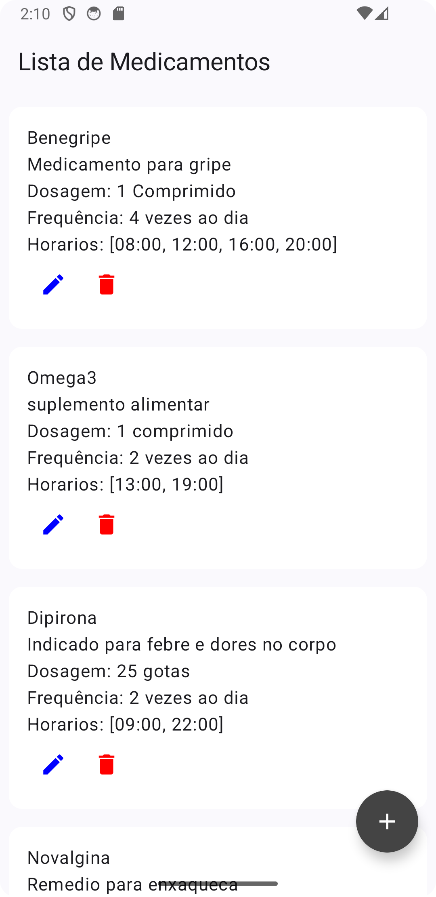
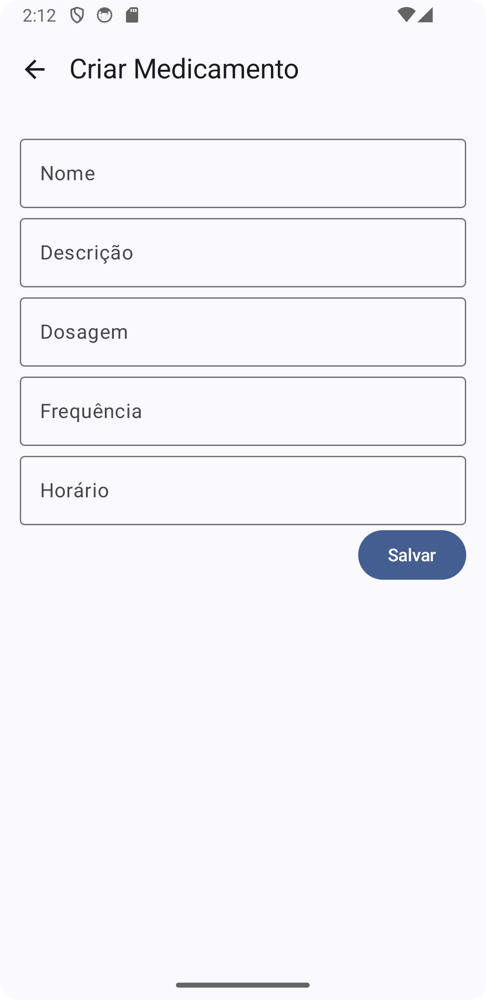
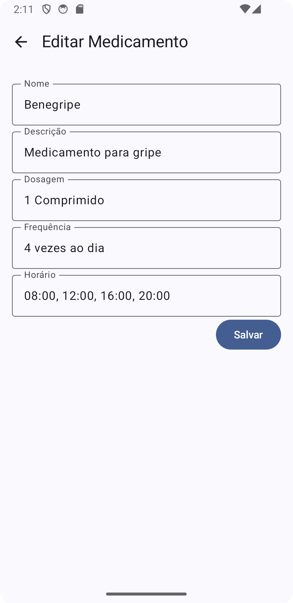
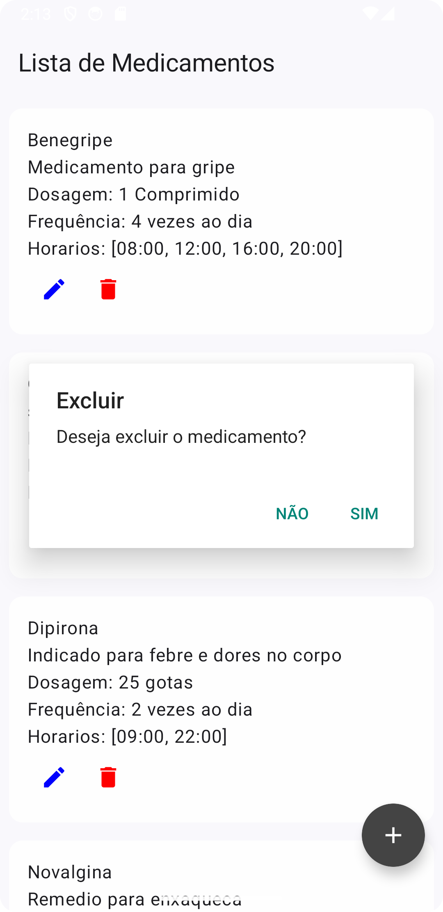

# Medtime: Aplicativo para gerenciamento de medicação


## Capturas de Tela


<div style="display:flex; flex-direction: row; justify-content: space-evenly; margin-top: 20px;">
  
  
  
  
</div>


## Baixar e configurar o projeto

- Clonar o repositório
  
```shell
  git clone https://github.com/faamaral/medtime.git
```

- Baixar arquivo google-services.json no firebase

> Vá em: `Configurações do projeto > Geral > Seus aplicativos > Apps Android` e baixo o arquivo `google-services.json` e salve-o na pasta do projeto `~/medtime/app`.

## Importante: Configuração do Git
    
```shell
    git config --global user.name "Nome Sobrenome"
    git config --global user.email "email@exemplo.com"
    git config --global color.ui true
    git config --global http.sslVerify false
```

## Documentação

- [Requisitos funcionais basicos](/docs/planning/reqs.md)

